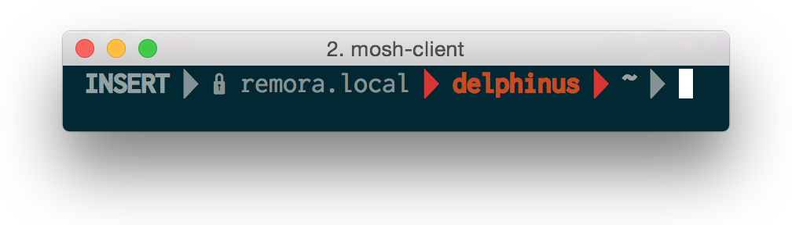

## mosh + Powerline

* [Mosh: the mobile shell](https://mosh.mit.edu/)
* [Powerline](https://github.com/powerline/powerline)

The shell status line drawed by Powerline in mosh may be shown in odd colors ([issued in mosh][issue]). [This PR][pr] can fix this. The formula in this repo can build patched mosh.

[issue]: https://github.com/keithw/mosh/issues/507
[pr]: https://github.com/keithw/mosh/pull/548

before       |after
:-----------:|:-----------:
|
